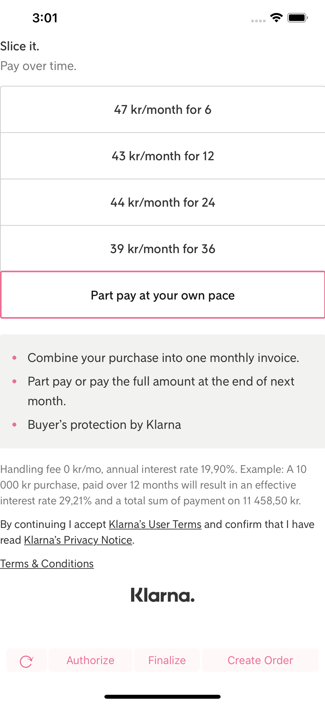
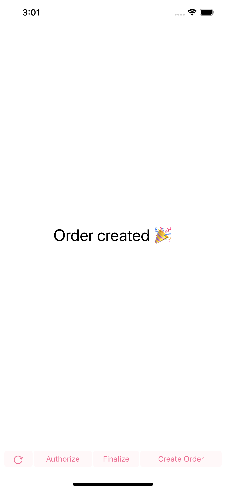

# Klarna Payments SDK for Mobile Apps - iOS Example App

<br/>

---
Klarna Payments SDK BETA, API subject to change.

---

<br/>


See SDK repository here https://github.com/klarna/kp-mobile-sdk


## Screenshots

   


## Setup

Before you build & run, download the `KlarnaPayments.framework`:

* Using Carthage:

    ```swift
    carthage update --no-build
    ```

* Using Cocoapods:

    ```swift
    pod install
    ```
